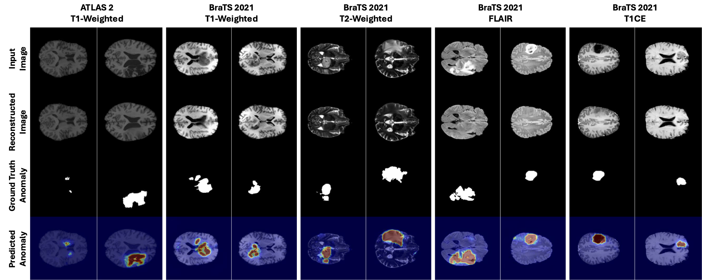

# ✨ REFLECT ✨
**A PyTorch Implementation for Unsupervised Brain Anomaly Detection**

This repository hosts the official PyTorch implementation for our paper accepted in MICCAI2025:  
"REFLECT: Rectified Flows for Efficient Brain Anomaly Correction Transport".

---

## 🎨 Approach


---

## ⚙️ Setup

### 🛠️ Environment

Our experiments run on **Python 3.11**. Install all the required packages by executing:

```bash
pip3 install -r requirements.txt
```

### 📁 Datasets

Prepare your data as follows:

1. **Data Registration & Preprocessing:**  
   - Register with MNI_152_1mm.
   - Preprocess, normalize, pad and extract axial slices.

2. **Dataset Organization:**  
   - Ensure **training** and **validation** sets contain only normal, healthy data.
   - **Test** set should include abnormal slices.
   - Organize your files using this structure:

   ```
   ├── Data
       ├── train
       │   ├── {train_image_id}_slice_{slice_idx}_{modality}.png
       │   ├── {train_image_id}_slice_{slice_idx}_brainmask.png
       │   └── ...
       └── test
           ├── {test_image_id}_slice_{slice_idx}_{modality}.png
           ├── {test_image_id}_slice_{slice_idx}_brainmask.png
           ├── {test_image_id}_slice_{slice_idx}_segmentation.png
           └── ...
   ```

---

## 🔧 Pretrained Weights & VAE Fine-Tuning

### Pretrained VAE Models

To jumpstart your experiments, we provide pretrained weights adapted for 1-channel medical brain images. These models are available on [HuggingFace](https://huggingface.co/farzadbz/Medical-VAE).

### Train & Fine-Tune VAE

If you prefer to train your own VAE from scratch, please refer to the [LDM-VAE repository](https://github.com/CompVis/latent-diffusion?tab=readme-ov-file#training-autoencoder-models) for detailed instructions.

---

## 🔗 DTD Embedding Download

The training script requires a precomputed **DTD embedding** file.

- **Download the DTD embeddings based on your desired VAE model (klf4 or klf8)**:

  - [klf8 dtd embeddings](https://drive.google.com/file/d/1I7jmzsHxC5IBm719dNVpWl5_zGFSVsM4/view?usp=share_link).
 
  - [klf4 dtd embeddings](https://drive.google.com/file/d/1zTwLiI3CdJmt4vWUt65eGWY5s0OAxZzf/view?usp=share_link).

- **Copy the downloaded file** to the directory you specify with the `--dtd-dir` argument.

---

## 🚄 Training REFLECT-1

To train the REFLECT-1 model, run the following command. This example uses a UNet_M architecture and integrates a pretrained VAE (with scale factor 8) for the T1 modality of the BraTS dataset:

```bash
torchrun train_REFLECT.py \
            --dataset BraTS \
            --model UNet_M \
            --image-size 256 \
            --vae kl_f8 \
            --modality T1 \
            --dtd-dir . \
            --data-dir .
            
```
Where:
- `--dataset`: `BraTS` or `ATLAS`
- `--model`: `UNet_XS`, `UNet_S`, `UNet_M`, `UNet_L`, `UNet_XL`
- `--vae`: `kl_f8` or `kl_f4`
- `--modality`: For BraTS: `T1`, `T2`, `FLAIR`, `T1CE`; for ATLAS: `T1`
- `--dtd-dir`: Path to the directory containing the DTD embedding file.
- `--data-dir`: Path to the root data directory.


## 🚄 Training REFLECT-2

To train the REFLECT-2 model, first ensure you have completed REFLECT-1 training. Then, launch REFLECT-2 training as shown below.
- Note: train_REFLECT-2.py automatically loads the required arguments from the YAML config file found in the parent directory of the specified REFLECT-1 model path, so you do not need to specify them manually:


```bash
torchrun train_REFLECT-2.py \
            --dtd-dir . \
            --data-dir . \
            --REFLECT-1-path ./REFLECT_BraTS_UNet_M_T1_256_kl_f8/006-UNet_M-T1/checkpoints/last.pt
```
where 
- `--REFLECT-1-path`: Path to the trained REFLECT-1 model checkpoint.

## 🚦 Evaluating REFLECT

To evaluate a trained REFLECT model, use the following command.
Note: evaluate_REFLECT.py also loads its configuration and arguments from the YAML file located in the parent directory of the given model checkpoint path. The script computes four evaluation metrics and saves per-image visualizations in the parent folder of the model path:

```bash
torchrun evaluate_REFLECT.py \
            --data-dir . \
            --model-path ./REFLECT_BraTS_UNet_M_T1_256_kl_f8/006-UNet_M-T1/checkpoints/last.pt
```
where 
- `--model-path`: Path to the trained model checkpoint (either REFLECT-1 or REFLECT-2).

---

## 📸 Sample Results



