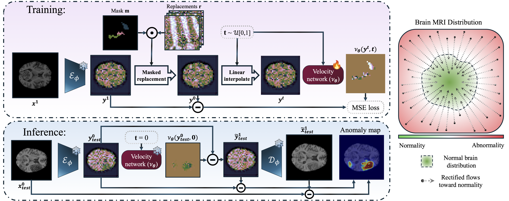

# ✨ REFLECT ✨
**A PyTorch Implementation for Unsupervised Brain Anomaly Detection**

This repository hosts the official PyTorch implementation for our paper accepted in MICCAI2025:  
"REFLECT: Rectified Flows for Efficient Brain Anomaly Correction Transport".

---

## 🎨 Approach



---

## ⚙️ Setup

### 🛠️ Environment

Our experiments run on **Python 3.11**. Install all the required packages by executing:

```bash
pip3 install -r requirements.txt
```

### 📁 Datasets

Prepare your data as follows:

1. **Data Registration & Preprocessing:**  
   - Register with MNI_152_1mm.
   - Preprocess, normalize, pad and extract axial slices.

2. **Dataset Organization:**  
   - Ensure **training** and **validation** sets contain only normal, healthy data.
   - **Test** set should include abnormal slices.
   - Organize your files using this structure:

   ```
   ├── Data
       ├── train
       │   ├── brain_scan_{train_image_id}_slice_{slice_idx}_{modality}.png
       │   ├── brain_scan_{train_image_id}_slice_{slice_idx}_brainmask.png
       │   └── ...
       └── test
           ├── brain_scan_{test_image_id}_slice_{slice_idx}_{modality}.png
           ├── brain_scan_{test_image_id}_slice_{slice_idx}_brainmask.png
           ├── brain_scan_{test_image_id}_slice_{slice_idx}_segmentation.png
           └── ...
   ```

---

## 🔧 Pretrained Weights & VAE Fine-Tuning

### Pretrained VAE Models

To jumpstart your experiments, we provide pretrained weights adapted for 1-channel medical brain images. These models are available on [HuggingFace](https://huggingface.co/farzadbz/Medical-VAE).

### Train & Fine-Tune VAE

If you prefer to train your own VAE from scratch, please refer to the [LDM-VAE repository](https://github.com/CompVis/latent-diffusion?tab=readme-ov-file#training-autoencoder-models) for detailed instructions.

---

## 🔗 DTD Embedding Download

The training script requires a precomputed **DTD embedding** file.

- **Download the DTD embeddings based on your desired VAE model (klf4 or klf8)**:

  - [klf8 dtd embeddings](https://drive.google.com/file/d/1I7jmzsHxC5IBm719dNVpWl5_zGFSVsM4/view?usp=share_link).
 
  - [klf4 dtd embeddings](https://drive.google.com/file/d/1zTwLiI3CdJmt4vWUt65eGWY5s0OAxZzf/view?usp=share_link).

- **Copy the downloaded file** to the directory you specify with the `--data-dir` argument.

---

## 🚄 Training REFLECT

To train REFLECT, run the following command. This configuration leverages a UNet_L model with data augmentation and integrates the pretrained VAE (with scale-factor 8):

```bash
torchrun train_REFLECT.py \
            --dataset BraTS2021 \  #choices: BraTS2021 & ATLAS2
            --model UNet_L \  #choices: UNet_XS, UNet_S, UNet_M, UNet_L, UNet_XL
            --image-size 256 \
            --augmentation True \
            --vae kl_f8 \  #choices: kl_f8 & kl_f4
            --modality T1 \  #choices: T1, T2, FLAIR or T1CE for BraTS2021, and T1 for ATLAS2
            --ckpt-every 10 \ 
            --data-dir . 
```

---

## 📸 Sample Results


